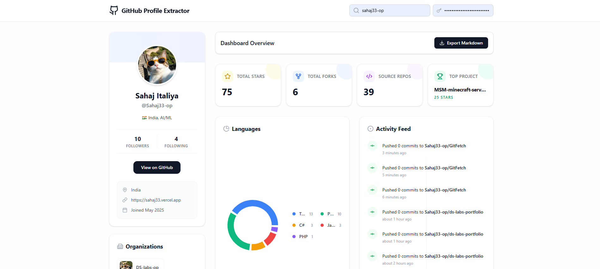

<div align="center">

# 🚀 GitHub Profile Extractor

<p align="center">
  
  
  
  
</p>

### A modern, responsive web application that extracts, visualizes, and exports GitHub user profiles with elegance.

**[🚀 Live Demo](https://gitfetch-sahaj33.vercel.app/)**

[Explore Features](#sparkles-features) • [Installation](#gear-getting-started) • [Usage](#rocket-usage)

<br />


</div>

---

## ✨ Features

- **📊 Comprehensive Dashboard:** Get an instant, beautiful overview of any GitHub user by simply entering their username.
- **📈 Actionable Insights:** Quick summaries of total stars, forks, repository counts, and identifying top projects.
- **🎨 Visual Language Stats:** Gorgeous interactive pie charts displaying the most-used programming languages.
- **⚡ Real-time Activity Feed:** A sleek timeline of recent GitHub events (pushes, PRs, issues, watches, creations).
- **📝 Profile README Rendering:** Impeccably rendered Markdown support for GitHub profile `README.md` files, exactly as the user intended.
- **🔍 Advanced Repository Explorer:** Browse, search, and sort public repositories. Dive into details like languages, stars, forks, and project inception dates.
- **📑 One-Click Markdown Export:** Export the entire comprehensive dashboard—stats, top languages, activity, and repos—into a pristine, ready-to-share Markdown document.

---

## 🛠️ Tech Stack

*   **Framework:** React 19 + Vite
*   **Language:** TypeScript
*   **Styling:** Tailwind CSS V4
*   **Icons:** Lucide React
*   **Data Visualization:** Recharts
*   **Markdown Parsing:** React Markdown (with GFM & raw HTML support)

---

## ⚙️ Getting Started

Get up and running in seconds.

1. **Install dependencies:**
   ```bash
   npm install
   ```

2. **Run the development server:**
   ```bash
   npm run dev
   ```

3. **Build for production:**
   ```bash
   npm run build
   ```

---

## 🚀 Usage

1. **Launch:** Open the application in your favorite browser.
2. **Discover:** Enter any GitHub username in the top search bar.
3. **Explore:** Navigate through their beautifully rendered stats, latest activities, language breakdown, and repository catalog.
4. **Export:** Click the "Export Markdown" button to instantly generate a portable summary of their developer profile.

---

<div align="center">
  <i>Built with passion using modern web technologies.</i>
</div>
